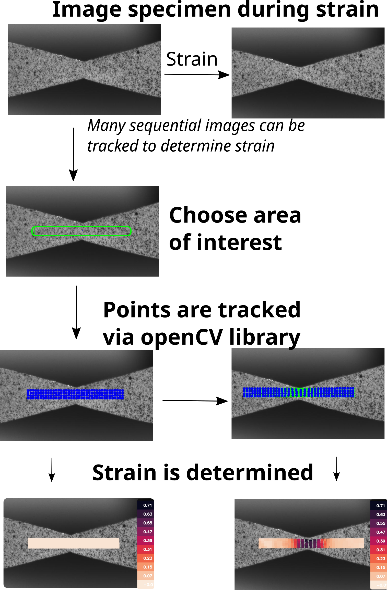

# Digital Image Correlation in Python

This software will measure strains on a sequence of images using the openCV image analysis library. 

**General DIC Steps**:

1. Speckle your specimen so locations on it can be tracked. 
2. Take images of the specimen prior to and during the straining.
3. Run this DIC software to determine Strains 
   1. Choose an area of interest.
   2. The software will determine the displacement of speckles and then the strain.
   3. Post processing can be done with efficiently stored data in the pickle formatted result files. 





# Installation

1. Download the source code from this github repository. 

2. Use the environment.yml file with Conda to install the dependencies:

   ```bash
   conda env create -f environment.yml
   ```

3. Activate the environment so the libraries area available when you run python:

   ```bash
   conda activate AA_DIC_env
   ```

   


# Examples

## Hourglass Specimen

The hourglass specimen is LDPE cut in such a way that a strain concentration is expected in the center of the specimen - see the images above. The strain profile clearly demonstrates high strains in the center, where the width is most narrow. 

Simply run the script *Example_1_Hourglass_specimen.py* with python. This can be done in your console with: 

```bash
python Example_1_Hourglass_specimen.py
```

A window will pop up in which the area of interest can be chosen. Simply click on two points in the window to create a rectangle of the area of interest. To restart click *r* , to confirm the area of interest click *c*. Each red dot within the rectangle represents a point being tracked, these are separated by *grid_size_px*. A window of size *window_size_px* is created around the point; this window is correlated with each image with the previous one to track the location of the points.  


## Series Specimen (PolyCOE) 

This sample has a predefined area of interest and has a separate script for post processing: 

To run the DIC analysis:

```bash
python Example_2.1_PolyCOE_DIC.py
```

To run the post processing 

```python
python Example_2.2_PolyCOE_Postprocess.py
```

 

# Branch for PolyCOE Sample

This branch of the repository exists to recreate the DIC results in the published report. Specifically the tensile test of the sample having soft (COR) and hard (TOR) segments in series. Two files are specific to this branch: *DIC_PolyCOE.py* and Plot_PolyCOE_Results.py. *DIC_PolyCOE.py* will perform the DIC algorithm, with the predefined parameters - grid size, window size and area of interest, etc. After installing the necessary prerequisite libraries 


## Credits 

Much of the code here was adapted from https://gitlab.com/damien.andre/pydic. Pydic is quite good in most circumstances. AA-DIC- was designed to run more efficiently when very many (>1k) images are being analyzed. Also, iterative correlation is optional with the tracking  algorithm here.   
